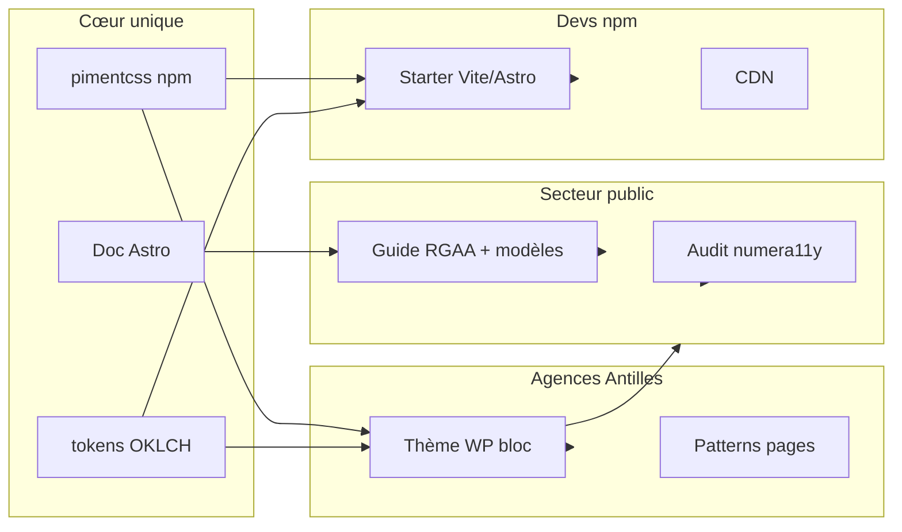

# PimentCSS — Prospective et stratégie de lancement

Document de référence pour le déploiement du design system auprès des **agences com et marketing aux Antilles**, du **secteur public (mairies, EPCI)** et des **développeurs npm**. Il complète [PRODUCT.md](PRODUCT.md) (principes produit et doc) et [README.md](README.md) (installation technique).

**Dernière mise à jour :** mai 2026

---

## 1. Contexte produit

PimentCSS est un design system **CSS-first** :

- Distribution **npm** (`pimentcss`), **Sass** (`@use "pimentcss" with (...)`), **CDN**, tokens OKLCH
- Classes composants documentées ; **le code compilé est la source de vérité** (`npm run test:doc-classes`)
- Cible primaire documentée : **développeurs front** qui intègrent, personnalisent et vérifient l’accessibilité
- Identité : claire, précise, accessible ; ancrage **Caraïbe / Antilles** et francophone
- Collaboration **Webmonster** × **numera11y** (crédibilité RGAA / WCAG)

Ce document répond à : *quelle intégration « prête à l’emploi » privilégier, et comment exploiter le DS pour qu’il soit réellement adopté ?*

---

## 2. Intégrations « prêtes à l’emploi » : comparatif

| Option | Adéquation avec PimentCSS | Effort / maintenance | Effet sur l’adoption |
|--------|---------------------------|----------------------|----------------------|
| **Starter dev (Vite / Astro) + CDN** | Excellente (alignée npm, doc Astro existante) | Faible à moyen | Forte chez les devs ; utile aux agences avec intégrateur |
| **Thème WordPress bloc (FSE)** | Bonne pour portée agences / collectivités | Élevé (Gutenberg, patterns, mises à jour WP) | Très forte localement ; risque de dérive si builders parallèles |
| **Template admin HTML** | Bonne pour back-offices / SaaS | Moyen | Segment vertical, pas masse |
| **Webflow** | Faible (double source de vérité, peu de npm) | Très élevé | Vitrine marketing, pas pilier d’adoption |

### Verdict

- **Ne pas choisir une seule plateforme** : adopter une **pyramide** de canaux.
- **Cœur (priorité 1)** : starters dev + snippets HTML + CDN
- **Vertical (priorité 2)** : **un** kit au choix entre thème WordPress bloc **ou** template admin (pas les deux en v1)
- **Amplification (priorité 3)** : Webflow / Figma comme vitrine, pas comme produit principal

**Webflow** : showcase et contenus (landing, conférences), pas intégration officielle du DS.

**Template admin** : pertinent si pivot explicite vers outils internes / dashboards ; secondaire pour les trois cibles actuelles.

---

## 3. Trois marchés, trois portes d’entrée

Les segments ne consomment pas le même produit. Stratégie : **un seul cœur technique**, **trois portes d’entrée**.

| Segment | Ce qu’il achète vraiment | Porte d’entrée « prête à l’emploi » | Message clé |
|--------|-------------------------|-------------------------------------|-------------|
| **Agences com / marketing (Antilles)** | Sites vitrine rapides, crédibles, identité locale | **Thème WordPress bloc (FSE)** + kit pages / patterns | Site livrable en quelques jours, accessible, sans lock-in builder propriétaire |
| **Secteur public (mairie, EPCI)** | Conformité, pérennité, traçabilité, open source auditable | **Thème WP** + **guide RGAA** + modèles de pages obligatoires | DS aligné RGAA ; contrastes documentés ; maintenance par prestataire local |
| **Devs npm purs** | Contrôle, bundle, tokens, CI, doc = bundle | **Starter Vite/Astro** + CDN + Sass | `npm install`, thème light/dark, classes identiques à la doc |

### Schéma d’architecture cible

---

## 4. Segment : agences com et marketing (Antilles)

### Pratiques habituelles

- Sites vitrine, campagnes, landings événements, refontes pour clients institutionnels
- Stack souvent **WordPress**, hébergement connu (OVH, o2switch, prestataire local)
- Peu de bande passante pour maîtriser un DS npm ; forte demande de **thème duplicable** (logo, couleurs, patterns)

### Offre recommandée

1. **Thème bloc léger** (repo dédié, ex. `pimentcss-wp-theme`) :
   - Patterns : accueil, actualités, contact, événement, équipe
   - Tokens / palette Antilles via variables CSS ou Sass
   - **Pas Elementor / Divi** en chemin officiel : dette technique et écart avec la doc des classes

2. **Kit agence** (ZIP ou dépôt partenaire) :
   - Maquettes HTML réutilisables comme patterns Gutenberg
   - Charte type : logo, `--surface-action`, typographies
   - Checklist livraison client (contrastes, focus, formulaires, déclaration d’accessibilité)

### Leviers d’adoption

- Formation ½ journée (présentiel Antilles ou distanciel) : « Livrer un site accessible avec PimentCSS »
- Offre **licence agence** : thème + support prioritaire + audit a11y annuel (Webmonster)
- **Showcase local** : 2 à 3 sites (mairie, office de tourisme, association) avec badge adopteur
- Réseaux : CCI, clusters numériques, French Tech Caraïbes, hébergeurs prescripteurs
- Contenu : avant/après accessibilité, pas uniquement « un framework de plus »

---

## 5. Segment : secteur public (mairies, EPCI)

### Attentes au-delà du visuel

- **RGAA** (obligation ou attente forte en marchés publics)
- **Pérennité** : maintenance par prestataire local, code auditable (MIT)
- **Transparence** : documentation des contrastes, formulaires, navigation clavier
- Compatibilité possible avec chartes existantes (État, région) : PimentCSS comme **couche accessible** (tokens custom), pas remplacement systématique d’une charte imposée

### Offre recommandée

1. **Même thème WordPress** que les agences, avec jeux de **patterns « institution »** distincts des patterns « com »
2. **Pack documentation secteur public** (pages doc ou PDF) :
   - Conformité : paires sémantiques AA, `:focus-visible`, `prefers-reduced-motion`
   - Modèles : mentions légales, accessibilité, plan du site, contact, démarches
   - Grille de contrôle RGAA mappée sur les composants (`btn`, `field`, `alert`, etc.)
   - Paragraphes types pour **déclaration d’accessibilité** + lien vers la doc couleurs
3. Option **site statique** (Astro) pour collectivités très simples sans CMS
4. Partenariat **numera11y** : audit + thème = offre conformité clé en main

### Formulation commerciale honnête

Ne pas promettre « certifié RGAA » sur le thème sans audit par site en production.

Formulation cible : *« Conçu pour faciliter la mise en conformité ; audit recommandé à la mise en production. »*

### Leviers d’adoption

- **Référence pilote** (une mairie ou un EPCI) prioritaire sur le volume GitHub
- Fiche solution pour **marchés publics** (MOA / MOE)
- Argument **open source** et souveraineté des données (pas de builder SaaS opaque)

---

## 6. Segment : développeurs npm purs

### Attentes

- `npm install pimentcss`, imports partiels (`core`, `components`, `tokens/*`)
- Sass `@use "pimentcss" with (...)` ; tokens canoniques `tokens/colors.css`
- Stack Vite, Astro, parfois React/Vue avec **classes CSS**, sans portage composants obligatoire en v1

### Offre recommandée

1. **Starter** (`create-pimentcss` ou `starter-vite-pimentcss`) :
   - Import CSS, `data-theme`, layout de base, page formulaire exemple
   - Phosphor en exemple d’icônes (aligné PRODUCT.md : slots dimensionnés, pas de lib globale imposée)
2. **CDN** documenté (jsDelivr / unpkg)
3. **Guides par stack** : React, Vue, Laravel Blade, Django, PHP (classes + tokens)
4. **Crédibilité technique** : badge CI (`test:doc-classes`, e2e a11y Playwright)
5. Extension VS Code / Cursor (snippets de classes)

### Leviers d’adoption

- Articles techniques : OKLCH, tokens sémantiques, zéro runtime JS
- Comparatif honnête Bootstrap / Tailwind / DS CSS-only
- Issues « good first issue » pour élargir la communauté
- Les devs npm **alimentent** les agences (sous-traitance) et certaines DSI qui refusent WordPress

---

## 7. Ordre de construction recommandé

Pour limiter la dispersion des efforts :

| Priorité | Livrable | Sert principalement |
|----------|----------|---------------------|
| 1 | CDN + page Quick start 60 s | Tous |
| 2 | Starter Vite ou Astro | Devs npm, agences avec intégrateur |
| 3 | Thème WordPress bloc v0.1 + 8 patterns | Agences, collectivités |
| 4 | Guide RGAA + modèles pages institution | Secteur public |
| 5 | Pilote mairie / EPCI + témoignage | Public, agences |
| 6 | Formation agences + partenaires hébergeurs | Agences |
| 7 | Kit Figma synchronisé sur `tokens/colors.css` | Design, complément |

**Décision v1 vertical :** lancer **thème WP** avant **template admin**, sauf pivot explicite SaaS / back-office.

**Un thème, deux familles de patterns** (com vs institution), pas deux codebases thème.

---

## 8. Roadmap indicative (6 mois)

| Phase | Livrable | Agences | Public | Devs npm |
|-------|----------|---------|--------|----------|
| M1 | CDN + starter Vite + snippets doc renforcés | ★★ | ★ | ★★★ |
| M2 | Thème WP v0.1 + 8 patterns | ★★★ | ★★ | ★ |
| M3 | Guide RGAA + modèles pages légales / accessibilité | ★ | ★★★ | ★ |
| M4 | 1 collectivité pilote + témoignage | ★★★ | ★★★ | ★ |
| M5 | Formation agences + partenaires hébergeurs | ★★★ | ★ | ★ |
| M6 | Figma tokens + composants formulaires avancés | ★★ | ★★ | ★★ |

---

## 9. Positionnement (une phrase)

> **PimentCSS : design system accessible, open source (MIT), pensé pour le web francophone et les Antilles — livrable en npm pour les développeurs, en thème WordPress pour les agences et les collectivités, avec une documentation qui prouve les contrastes et l’existence des classes dans le bundle.**

Co-branding **Webmonster × numera11y** recommandé sur le **pack secteur public** (confiance MOA, appels d’offres).

---

## 10. Idées d’exploitation complémentaires

### Adoption technique

- Snippets VS Code / Cursor
- Checklist RGAA / WCAG dans la doc (lien Layout, A11y, Colors)
- Outil interactif de contrastes (paires `--text-*` / `--surface-*`)
- Guide de migration depuis **Piment-Css** / anciens préfixes

### Crédibilité

- Badge « Built with PimentCSS » + galerie adopteurs
- Étude de cas Webmonster (avant / après accessibilité)
- Comparatif transparent avec autres frameworks CSS

### Écosystème design

- Kit Figma dérivé de `tokens/colors.css` (design suit le code, pas l’inverse)
- Export variables CSS pour outils légers (secondaire)

### Commercial / communauté

- Offre audit + thème (numera11y + Webmonster)
- Workshops « UI accessible en 2 h » avec le starter
- Programme partenaires agences (formation + support)

### À éviter au lancement

- Plugin WP + thème + builder (Elementor) en parallèle
- Portage React complet du DS en v1
- Multiplication des plateformes avant solidité doc + `dist/pimentcss.min.css`

---

## 11. Décisions ouvertes

À trancher selon la pression terrain :

1. **WordPress d’abord ou starter npm d’abord ?**
   - Contacts mairies / agences forts → WP juste après un CDN minimal
   - Priorité crédibilité GitHub / npm national → starter puis WP

2. **Repos séparés suggérés**
   - `pimentcss` (actuel) : package npm et doc
   - `pimentcss-wp-theme` : thème bloc
   - `starter-vite-pimentcss` : template applicatif

3. **Pages doc à ajouter** (dans `docs-site/`)
   - « Démarrer en agence » (WP + checklist livraison)
   - « Collectivités » (RGAA, modèles, rôles MOA / MOE)

---

## 12. Prochaines actions concrètes (backlog)

- [ ] Documenter CDN officiel dans README et doc Astro
- [ ] Créer repo starter Vite (import `pimentcss`, thème, layout, formulaire)
- [ ] Spécifier périmètre v0.1 thème WP (patterns, `theme.json`, enqueue CSS)
- [ ] Rédiger guide RGAA secteur public (PDF ou section doc)
- [ ] Identifier 1 pilote mairie ou EPCI + 1 agence partenaire Antilles
- [ ] Préparer formation agence (support slides + checklist)
- [ ] Définir critères badge adopteur et page showcase

---

## Références internes

- [PRODUCT.md](PRODUCT.md) — principes produit, anti-références, accessibilité doc
- [README.md](README.md) — installation npm, Sass, structure repo
- [DEPLOYMENT.md](DEPLOYMENT.md) — déploiement doc (GitHub Pages, Netlify)
- Site : [pimentcss.webmonster.tech](https://pimentcss.webmonster.tech)
